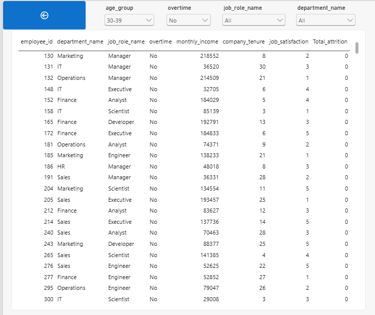

# Employee Attrition Analysis — End-to-End HR Analytics Project

A 100K-row employee dataset broken down across four tools — Python, SQL, Excel, and Power BI — to find out where attrition actually comes from and where it doesn't.

## The Core Finding

Attrition in this dataset isn't spread across departments, age groups, or tenure bands — it's almost entirely explained by one interaction: **overtime = Yes AND job satisfaction ≤ 2**.

- **High-risk segment** (overtime + low satisfaction): 20,109 employees → **5,085 left → 25.3% attrition**
- **Everyone else**: 79,891 employees → **0 left → 0.0% attrition**

Every single attrition case in the dataset falls inside that one segment. Department (4.9%–5.3%), age group (4.9%–5.3%), tenure band (4.9%–5.2%), and income band (4.8%–5.3%) all look like they sit around a flat ~5% — but that's only because the high-risk segment is spread proportionally across each of them. None of those factors are actually driving attrition on their own; overtime + dissatisfaction is the only real signal in the data.

## Dataset

- **Employee_Attrition_Prediction_Dataset_100K.csv** — 100,000 employee records, 40 features, sourced from [Kaggle](https://www.kaggle.com/)
- Overall attrition rate: 5.1% (5,085 of 100,000)
- Covers demographics, compensation, job role, satisfaction scores, overtime status, and tenure

## Project Structure

```
├── Python/
│   └── Phase1_Data_Cleaning_EDA.ipynb   # Cleaning + basic exploratory analysis
├── Sql/
│   ├── attrition.db                      # Star-schema SQLite database
│   └── queries.sql                       # 12 analysis queries
├── Excel/
│   └── attrition_dashboard.xlsx          # Pivot-table dashboard with KPI cards
├── Power BI/
│   └── HR DASHBOARD.pbix                 # 3-page interactive report
└── Images/                               # Dashboard screenshots
```

## Methodology

**1. Python — Cleaning & EDA**
Raw data checked for nulls, duplicates, and type issues, then explored with basic distribution and attrition-rate visualizations to get an initial read on which variables looked worth investigating further in SQL.

**2. SQL — Star Schema & Query Analysis**
Data modeled into a star schema in SQLite, then queried with 12 analysis queries covering attrition rate by department, job role, overtime, tenure band, income band, and satisfaction score — including the overtime × satisfaction breakdown that produced the core finding above.

**3. Excel — Dashboard**
A pivot-table-driven dashboard using SUMIFS/COUNTIFS, KPI cards, and a department dropdown filter, breaking down headcount and attrition rate by department, risk segment, age group, income band, and tenure group, plus the overtime × satisfaction cross-tab that isolates the high-risk group.

**4. Power BI — Interactive Report**
A 3-page report built on DAX measures:
- **Overview** — KPI cards (total employees, attrition count, overall rate, high-risk segment rate) plus attrition rate by department and a high-risk-vs-rest comparison
- **Deep Dive** — a department × job role attrition cross-tab, an income-band trend line, and a filterable table of high-risk employees (overtime + low satisfaction) with gender and remote-work slicers
- **Detail** — an employee-level lookup table filterable by age group, overtime, job role, and department, for drilling into individual records

## Sample Queries & Output

A few of the 12 queries, run against `Sql/attrition.db`:

**Overall headcount and attrition rate**
```sql
SELECT COUNT(*) AS headcount, SUM(attrition) AS attritions,
       ROUND(100.0 * SUM(attrition) / COUNT(*), 2) AS attrition_rate_pct
FROM employees;
```
| headcount | attritions | attrition_rate_pct |
|-----------|------------|---------------------|
| 100,000   | 5,085      | 5.08%               |

**Attrition rate by department, ranked**
```sql
SELECT d.department_name, COUNT(*) AS headcount, SUM(e.attrition) AS attritions,
       ROUND(100.0 * SUM(e.attrition) / COUNT(*), 2) AS attrition_rate_pct,
       RANK() OVER (ORDER BY 1.0 * SUM(e.attrition) / COUNT(*) DESC) AS attrition_rank
FROM employees e
JOIN dim_department d ON d.department_id = e.department_id
GROUP BY d.department_name
ORDER BY attrition_rate_pct DESC;
```
| department  | headcount | attritions | attrition_rate_pct | rank |
|-------------|-----------|------------|---------------------|------|
| Finance     | 16,688    | 891        | 5.34%               | 1    |
| HR          | 16,653    | 863        | 5.18%               | 2    |
| Operations  | 16,524    | 856        | 5.18%               | 3    |
| Sales       | 16,897    | 846        | 5.01%               | 4    |
| IT          | 16,677    | 822        | 4.93%               | 5    |
| Marketing   | 16,561    | 807        | 4.87%               | 6    |

**The high-risk segment: overtime × job satisfaction**
```sql
SELECT overtime,
       CASE WHEN job_satisfaction <= 2 THEN 'Low (1-2)' ELSE 'OK (3-5)' END AS satisfaction_bucket,
       COUNT(*) AS headcount, SUM(attrition) AS attritions,
       ROUND(100.0 * SUM(attrition) / COUNT(*), 2) AS attrition_rate_pct
FROM employees
GROUP BY overtime, satisfaction_bucket
ORDER BY attrition_rate_pct DESC;
```
| overtime | satisfaction  | headcount | attritions | attrition_rate_pct |
|----------|---------------|-----------|------------|---------------------|
| Yes      | Low (1-2)     | 20,109    | 5,085      | **25.29%**          |
| No       | Low (1-2)     | 20,042    | 0          | 0.0%                |
| No       | OK (3-5)      | 29,838    | 0          | 0.0%                |
| Yes      | OK (3-5)      | 30,011    | 0          | 0.0%                |

This last table is the whole story: every attrition case in the dataset sits in exactly one of the four buckets above.

## Screenshots




## How to Reproduce

1. Clone the repo
2. Run `Python/Phase1_Data_Cleaning_EDA.ipynb` to regenerate the cleaned dataset
3. Load `Sql/attrition.db` in any SQLite client and run `Sql/queries.sql`
4. Open `Excel/attrition_dashboard.xlsx` or `Power BI/HR DASHBOARD.pbix` to explore interactively

## Tools

Python (pandas, matplotlib) · SQL (SQLite) · Excel · Power BI (DAX)
