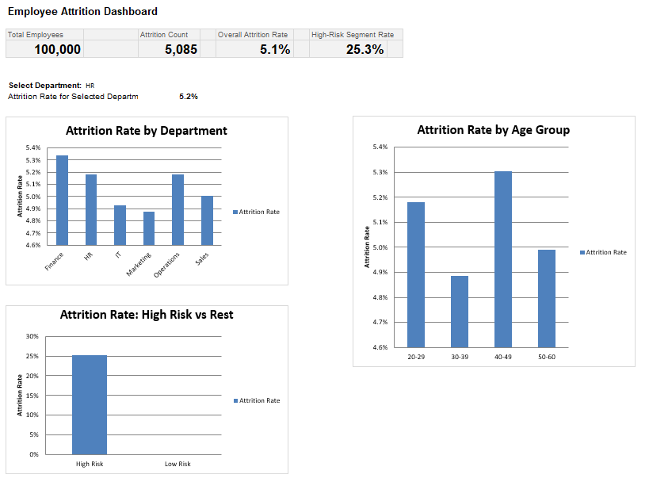
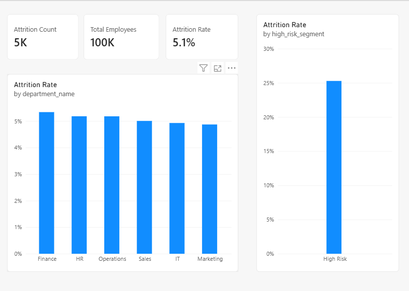
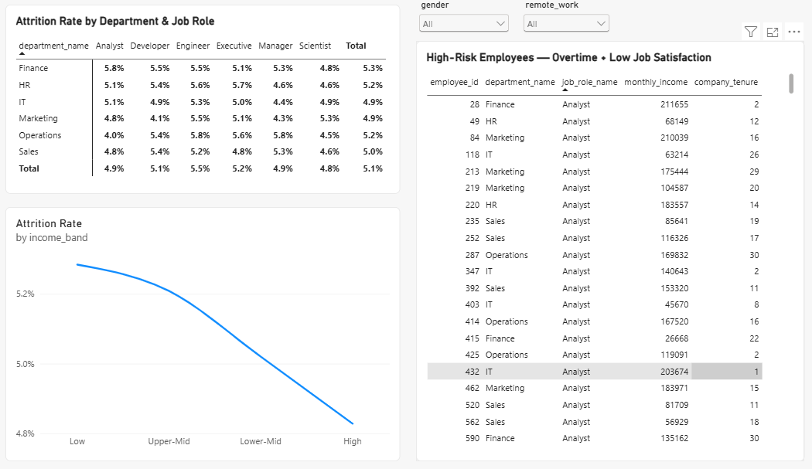

# Employee Attrition Analysis — End-to-End Data Analyst Project

100K-row employee dataset analyzed across Python, SQL, Excel, and Power BI.

## Core Insight
Attrition is concentrated almost entirely in one segment: employees working
overtime **and** reporting job satisfaction ≤ 2 show a 25.3% attrition rate.
Every other segment (department, age, income, tenure) sits flat around 5%.

## Tools & Deliverables
- **Python** — data cleaning + basic EDA (`Python/Phase1_Data_Cleaning_EDA.ipynb`)
- **SQL** — star-schema SQLite DB + 12 advanced queries (`Sql/attrition.db`, `Sql/queries.sql`)
- **Excel** — dashboard with SUMIFS/COUNTIFS pivot tables, KPI cards, dynamic filter (`Excel/attrition_dashboard.xlsx`)
- **Power BI** — 3-page interactive report with DAX measures (`Power BI/HR DASHBOARD.pbix`)

## Screenshots

